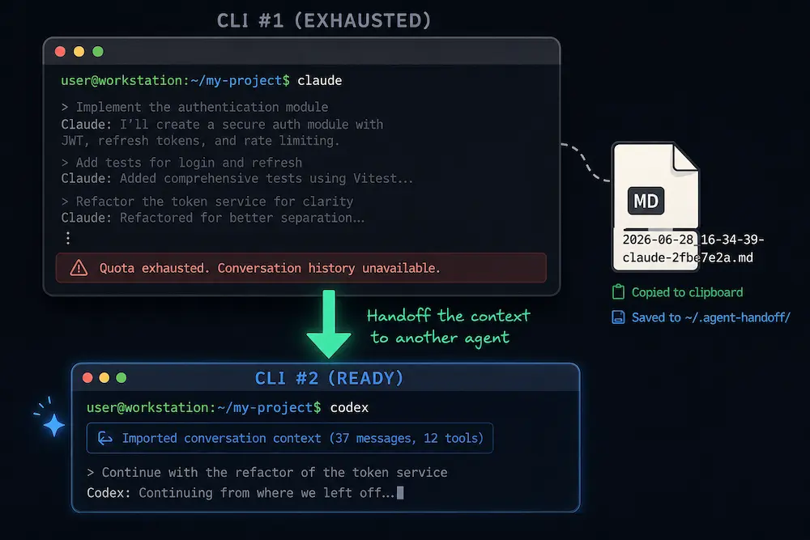

# agent-handoff



Tired of losing access to the content of your coding-agent conversation when your quota is
exhausted and you can no longer rely on the LLM to recall it?

Extract conversation transcripts from local AI coding agent logs — **no LLM, pure file parsing**.
When you run out of quota in one agent, recover the context from disk and hand it to another.
Run `agent-handoff export`: it retrieves the conversation, copies it to your clipboard, and saves
it as a Markdown file so another agent can pick up where the first one stopped.

```bash
! agent-handoff export
```

Supports **Claude Code**, **Codex**, **OpenCode**, **Cursor CLI**, and **Devin**. The current working
directory is the filter: run it from a repo (or git worktree) and you see only that directory's
sessions.

## Install

### Homebrew

```bash
brew install LivioGama/tap/agent-handoff
```

Builds from source via Cargo (requires the `rust` build dependency, which Homebrew installs
automatically).

### From source

```bash
./scripts/install.sh
```

The installer runs `cargo install --path . --locked --force`, verifies the binary, and adds Cargo's
bin directory to your shell PATH when it is missing.

Manual Cargo install:

```bash
cargo install --path . --locked --force
```

## Usage

```bash
# roster of sessions for the current dir, across all agents, newest first
agent-handoff list

# only your N most-recently-modified sessions
agent-handoff list --active 3

# recency window (default is 1d) — skips opening/stat-ing stale files (much faster)
agent-handoff list --since 5m        # 5m, 2h, 3d …
agent-handoff list --all             # full history (slower)

# restrict to one agent
agent-handoff list --agent codex          # claude | codex | opencode | cursor | devin

# export the newest session here: saves a .md to ~/.agent-handoff/, copies it to the clipboard, and opens it
agent-handoff export
# → Saved ~/.agent-handoff/2026-06-28_16-34-39-claude-2fbe7e2a.md (...), copied to clipboard, and opened it.

# print to stdout instead (for piping)
agent-handoff export --stdout | less

# a specific session by id (recency window is ignored for explicit ids), with tool calls
agent-handoff export <session-id> --tools

# machine-readable
agent-handoff list --json
agent-handoff export --json

# target a different directory / worktree
agent-handoff list --cwd /path/to/worktree
```

## How it finds sessions

| Agent | Storage | Match by |
|---|---|---|
| Claude Code | `~/.claude/projects/<slug>/*.jsonl` | dir = slug of cwd (`/`,`.`→`-`) |
| Codex | `~/.codex/sessions/**` + `archived_sessions/` | `session_meta.cwd` field |
| OpenCode | `~/.local/share/opencode/opencode.db` (SQLite) | `session.directory` column |
| Cursor CLI | `~/.cursor/projects/<slug>/agent-transcripts/**/*.jsonl` | dir slug |
| Devin | `~/.local/share/devin/cli/sessions.db` (SQLite) | `working_directory` column |

Each session is fingerprinted (git branch + first/last user prompt + prompt count) so you can tell
which terminal it belongs to when several share a directory.

Not covered: Cursor's GUI chat SQLite store.

## Performance

Sessions are filtered by a recency window (default `1d`) using cheap filesystem stats — and for
Codex, by pruning its date-partitioned (`sessions/Y/M/D/`) directory tree — *before* any transcript
is opened. Stale files are never touched. Measured on a tree of 2159 Codex sessions (2.2 GB):

| command | time |
|---|--:|
| `list` (default 1d) | ~240 ms |
| `list --since 5m` | ~260 ms |
| `list --agent codex --since 5m` | ~48 ms |
| `list --all` (full history) | ~3.5 s |
| `list --agent codex --all` | ~2.2 s |

i.e. the default/recent path is ~15× faster than scanning all history; for Codex alone the date
pruning is ~45×. Codex header scanning is also parallelized across cores via scoped threads.

## Test

```bash
cargo test   # 18 tests: per-adapter parse/fingerprint, date pruning, duration parsing
```

## License

MIT
